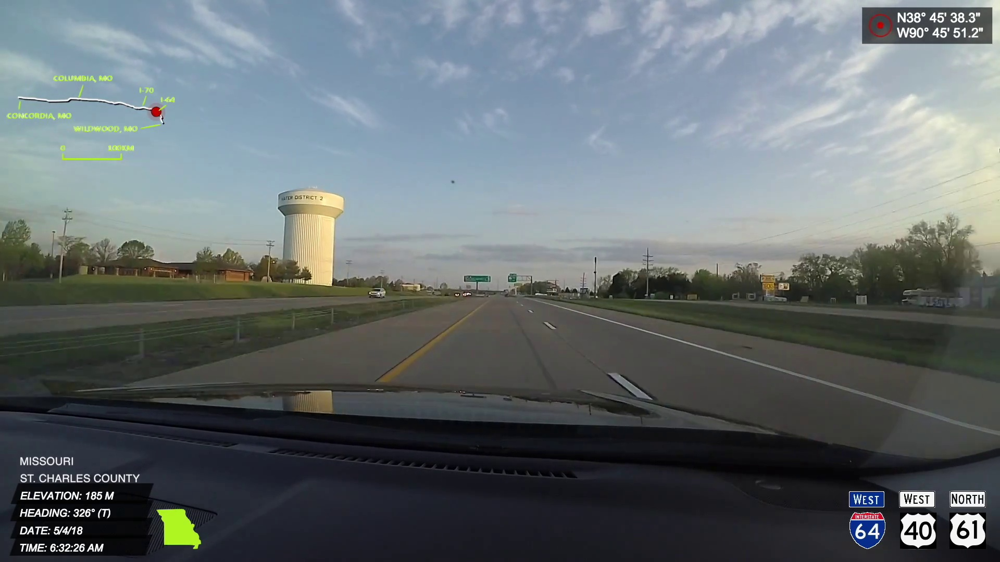
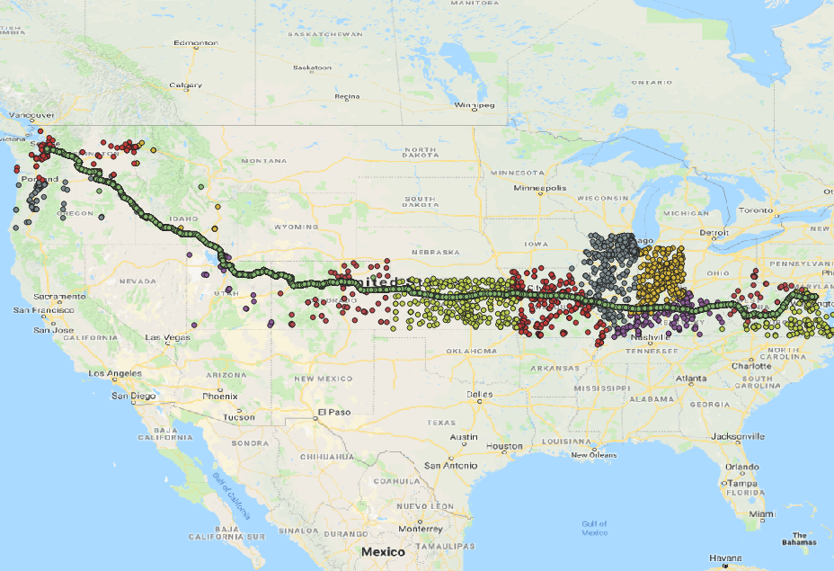
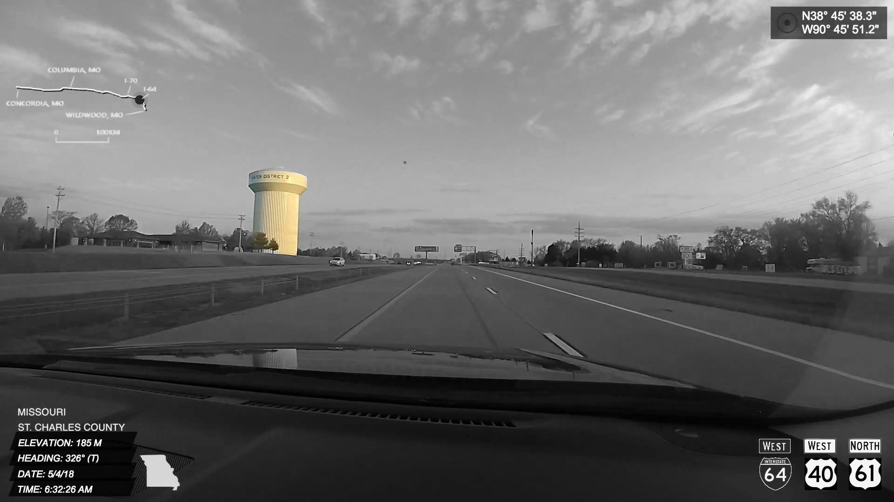

# CV-to-Maps
Travel Video Object Detection with OSM-Based Evaluation

## Purpose

The purpose of this project is to create a way to automatically geolocate objects of interest observed and identified in a dashcam camera video, so they could be added to the OpenStreetMap (OSM) database without manual geotagging by OSM volunteers.

The project involves a pipeline that processes a dashcam camera video that has every video frame geotagged by the camera's GPS functionality, identifies all objects of interest across all video frames, geolocates those objects by assigning latitude and longitude values to each of those objects, and evaluates the results of geolocation against existing OSM data.

For this project, a cross-country road trip video was selected and water tower was selected as the object of interest.  The input video is required for every frame to include both the GPS coordinates and the heading (i.e., viewing angle) of the camera.

## Workflow

1. **Video Processing - extract frames from video**

**CODE:** Video_Processing.py

The video used was shot using the Garmin Virb Ultra 30 camera, which records GPS information.  The code extracts frames from a 30fps video and saves them as JPG files.  Given the length of the video (11 hours showing over 3,000 miles of driving from Washington, DC to Seattle, WA), only one frame per second was captured to minimize processing time.  Still, the code was run on a AWS EC2 instance and produced nearly 40,000 images totaling 11.9GB of disk space.  The video was captured in full HD format, so the resulting resolution of each image is 1920x1080.

The code was run on a AWS EC2 instance, and the full AWS implementation pipeline can be found in the "AWS workflow" PDF document above.

An example of output video frame file (with a white water tower shown) is provided below:



2. **Image Processing - crop and save text boxes from each frame image**

**CODE:** Image_Processing.py

As can be seen in the image above, each frame contains a geolocation stamp in the upper-right corner and a place/elevation/date/time/heading stamp in the lower-left corner.  The code separately crops and saves the two corners of each frame and saves them to separate GPS box folder (geolocation stamps) and Location box folder (place/time/heading stamps).

3. **GPS Text Recognition - convert images to text**

**CODE 1:** AWS_Rekognition_OCR.py
- Code for creating a dictionary of text detected on video frames (both GPS stamp and location/time/heading stamp) using AWS Rekognition service (not used due to prohibitive cost)

**CODE 2:** GPS_Text_Recognition.ipynb
- Reads GPS stamps from gps_box folder and uses the Pytesseract library to convert images to text
- Creates image_dict_final dictionary of the form {‘frameXXXXX’: {‘Lat’: xx.xxxxx, ‘Lon’: xx.xxxxx}}
- Saves dictionary to image_txt.json file (as JSON)

4. **Obtain OSM data for evaluation**

**CODE:** None

I used the [OSM Overpass Turbo](http://overpass-turbo.eu/) website to pass queries to Overpass API and download coordinates of water towers in the 12 U.S. states covered by the cross-country drive.  Overpass API is a read-only API that serves up custom selected parts of the OSM map data.  It acts as a database over the web: the client sends a query to the API and gets back the data set that corresponds to the query.  Overpass API is optimized for data consumers that need a few elements within a glimpse or up to roughly 10 million elements in some minutes, both selected by search criteria like e.g. location, type of objects, tag properties, proximity, or combinations of them (source: https://wiki.openstreetmap.org/wiki/Overpass_API).

Below is a sample query used to retrieve the data for Washington State:

```
[out:json][timeout:25];
// fetch area “WA” to search in
{{geocodeArea:WA}}->.searchArea;
// gather results
(
  // query part for: “building=water_tower”
  node["building"="water_tower"](area.searchArea);
  way["building"="water_tower"](area.searchArea);
  relation["building"="water_tower"](area.searchArea);
  // query part for: “man_made=water_tower”
  node["man_made"="water_tower"](area.searchArea);
  way["man_made"="water_tower"](area.searchArea);
  relation["man_made"="water_tower"](area.searchArea);
);
// print results
out body;
>;
out skel qt;
```

Data was downloaded in GeoJSON file format.  The output files can be obtained from (and viewed on a map in) the "state_water_towers" folder.

5. **Geospatial processing - load frame and tower geolocation data to PostgreSQL**

**CODE:** Geospatial.ipynb
- Converts image_txt.json with lat-lon coordinates of video frames into a GeoJSON file
- Imports GeoJSON into PostgreSQL database (frames table)
- Loads water tower GeoJSONs into PostgreSQL database (towers table)
- Calculates and adds centroid of each tower polygon to the table
- Creates new table (nneighbors) that assigns the ID of the closest water tower for every video frame, with corresponding distance value (using PostGIS functionality)

After calculating the centroids of each tower, a map like the one shown below can be produced that displays the coordinates of both the water towers (as recorded in OSM) and each of the video frames.



Per investigation included in the notebook, in my particular case I ended up with 13 water towers tagged in the OSM database that had at least one video frame geolocated within 300 meters of that tower.

6. **Object detection/image segmentation**

I first used [VIA (VGG Image Annotator)](http://www.robots.ox.ac.uk/~vgg/software/via) to annotate water tower images available for academic research and education purposes from the [Places365](http://places2.csail.mit.edu/download.html) dataset.  Places contains more than 10 million images comprising 400+ unique scene categories. The dataset features 5000 to 30,000 training images per class, consistent with real-world frequencies of occurrence. Using convolutional neural networks (CNN), Places dataset allows learning of deep scene features for various scene recognition tasks, with the goal to establish new state-of-the-art performances on scene-centric benchmarks.

I downloaded the water tower images (of which there are 17,696 different images available) in the high-resolution format per instructions provided at http://data.csail.mit.edu/places/places365/train_large_split/link.txt.  These images have been resized to have a minimum dimension of 512 while preserving the aspect ratio of the image.

Only about 240 images were annotated and were split into train and validation sets of equal size.

**CODE 1:** Mask_RCNN/samples/water_towers/tower.py

This code was based on the sample Mask RCNN code provided at https://github.com/matterport/Mask_RCNN/tree/master/samples/balloon.  The code uses weights computed on COCO dataset with Mask RCNN model as a starting point to train a model to detect and segment water towers.  The pre-trained COCO weights were obtained from https://github.com/matterport/Mask_RCNN/releases/download/v2.0/mask_rcnn_coco.h5.  The code uses Keras with the TensorFlow backend.  I used AWS to run training code: `python3 tower.py train --dataset=/path/to/tower/dataset --weights=coco`, with the following parameters for training configuration:

```
EPOCHS = 50
STEPS_PER_EPOCH = 1000
BACKBONE = "resnet101"
LEARNING_RATE = 0.001
LEARNING_MOMENTUM = 0.9
WEIGHT_DECAY = 0.0001
LAYERS TO TRAIN = 5+
augmentation = imgaug.augmenters.Sometimes(0.5, [
    imgaug.augmenters.Fliplr(0.5),
    imgaug.augmenters.GaussianBlur(sigma=(0.0, 5.0))
]
```
The code was run on a AWS p2.xlarge EC2 instance (11.75 ECUs, 4 vCPUs, 2.7 GHz, E5-2686v4, 61 GiB memory).

Next, I used AWS to run splash code: `python3 tower.py splash --weights=/path/to/weights/file.h5 --image=<URL or path to file>` to save object detections.

Below is an example of splash applied to an image following the image segmentation/object detection step:



**CODE 2:** Mask_RCNN/samples/water_towers/save_splash_imgs.py
- Uses list of detections (results.pkl) and path to all images that went through detection to identify just the images that had at least one object detected and save the splash version of those images
- Code was run on AWS: `python3 save_splash_imgs.py --image='/home/ec2-user/dltraining/frames_1ps'`

**CODE 3:** Mask_RCNN/samples/water_towers/get_pixels_of_detections.py
- Uses list of detections (results.pkl), list of all file names that went through detection (fnames.json) and separately manually prepared file of file names that had correct detections (masks applied) to save mask info for relevant images to new dictionary with frame identifier as key
  - dictionary saved to masks_dict.pkl file
  - Used AWS to run code: `python3 get_pixels_of_detections.py --image_list='/home/ec2-user/dltraining/Mask_RCNN/samples/water_towers/splash_list.txt'`

7.  **Depth prediction**

As explained in Krylov et al., objects observed in images can be geotagged via triangulation through a three-step process: (1) image segmentation using one fully convolutional neural network, (2) estimation of distance from the camera using another fully convolutional neural network (depth estimation step), and (3) object triangulation using a customer Markov Random Field model.  Image segmentation was completed in the previous step.  In the current step, we use the pixel-level labels from the image segmentation output as input to the depth estimation FCNN, which we implement using TensorFlow.

**CODE 1:** Mask_RCNN/samples/water_towers/load_resize_detections_and_depth_predictions.ipynb
- Exploration notebook investigating how to work with object detection (mask) and depth prediction arrays

**CODE 2:** Mask_RCNN/samples/water_towers/save_depth_estimates.ipynb
- loads dictionary of masks (pixel locations of correctly identified towers), identifies locations (indices) of pixels where splash is located, runs depth detection code on that image (Github/FCRN-DepthPrediction/predict_nomain.py), accesses the pixels of mask in the depth prediction array and computes 10% trimmed mean over those depth values

8.  **Geolocation via triangulation**

**CODE 1:** CV-to-Maps/Create_detection_input_file.ipynb
- Reads info from image_txt.json (Lat/Lon values for each video frame), depth_values dictionary (created in save_depth_estimates.ipynb), and heading/bearing values to create a combined detection_input CSV file with all of the necessary information for each image

**CODE 2:** object_mapping.py (called by Object_mapping.ipynb)
- Modified implementation of the MRF-based tringulation procedure introduced in "Automatic Discovery and Geotagging of Objects from Street View Imagery" by V. A. Krylov, E. Kenny, R. Dahyot.  https://arxiv.org/abs/1708.08417
- Object_mapping.ipynb also calls the object_mapping.py script within a loop to generate multiple detected tower positions that are then averaged.

**CODE 3:** Check_Preliminary_Object_Positions.ipynb
- Uses modified GoogleMapPlotter class from the gmplot package to plot initial tower positions calculated from camera position, camera bearing, and depth_estimates (requires obtaining a Google Maps API account)

**CODE 4:** Plot_Coordinates_Using_Google_Maps.ipynb
- Uses modified GoogleMapPlotter class from the gmplot package to plot both the actual positions of the camera as the car was driving and the geotagged position of the tower

**CODE 5:** Compare_Geotagging_to_OSM.ipynb
- Queries OSM-tagged (true) coordinates of water tower that was used in geotagging code, then uses modified GoogleMapPlotter class from the gmplot package to plot the true water tower coordinates (from OSM), coordinates of the camera positions as the car was driving, tower positions calculated from camera position, camera bearing, and depth_estimates, and the averaged tower position calculated by running the detection code multiple times.

## References:

1. Abdulla, W., Mask R-CNN for object detection and instance segmentation on Keras and TensorFlow, (2017), GitHub repository, https://github.com/matterport/Mask_RCNN

2. Krylov, V., Streetview objectmapping, (2018), Github repository, https://github.com/vlkryl/streetview_objectmapping

3. Krylov, V.A., Kenny, E., Dahyot, R. Automatic Discovery and Geotagging of Objects from Street View Imagery. *Remote Sensing*. 2018; 10(5):661.

4. Laina, Iro and Rupprecht, Christian and Belagiannis, Vasileios and Tombari, Federico and Navab, Nassir, Deeper depth prediction with fully convolutional residual networks, (2016), Github repository, https://github.com/iro-cp/FCRN-DepthPrediction
